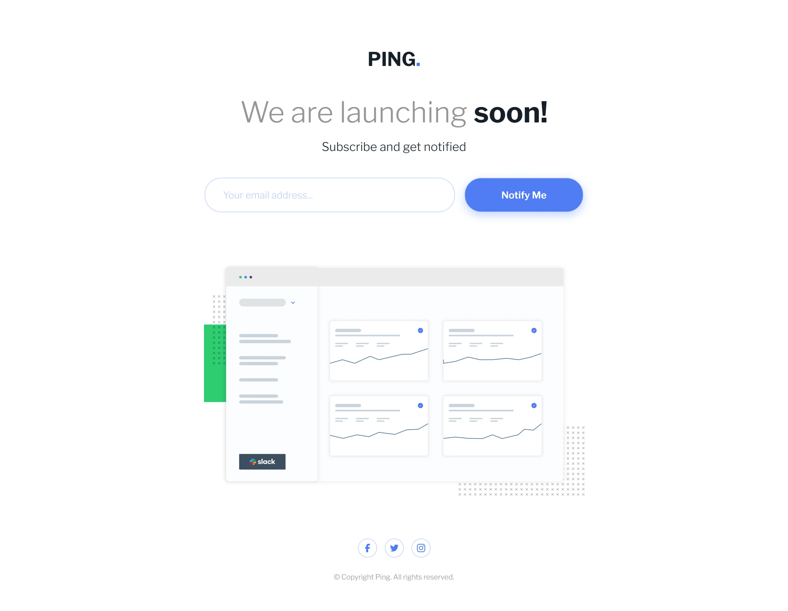
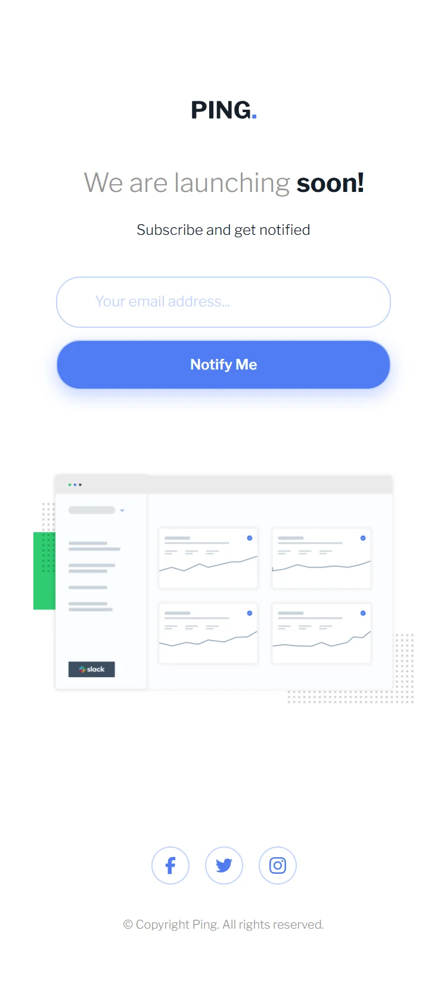

# Frontend Mentor - Ping coming soon page solution

This is a solution to the [Ping coming soon page challenge on Frontend Mentor](https://www.frontendmentor.io/challenges/ping-single-column-coming-soon-page-5cadd051fec04111f7b848da). Frontend Mentor challenges help you improve your coding skills by building realistic projects.

## Table of contents

- [Overview](#overview)
  - [The challenge](#the-challenge)
  - [Screenshots](#screenshots)
  - [Links](#links)
- [My process](#my-process)
  - [Built with](#built-with)
  - [Useful resources](#useful-resources)
- [Author](#author)

## Overview

### The challenge

Users should be able to:

- View the optimal layout for the site depending on their device's screen size
- See hover states for all interactive elements on the page
- Submit their email address using an `input` field
- Receive an error message when the `form` is submitted if:
  - The `input` field is empty. The message for this error should say _"Whoops! It looks like you forgot to add your email"_
  - The email address is not formatted correctly (i.e. a correct email address should have this structure: `name@host.tld`). The message for this error should say _"Please provide a valid email address"_

### Screenshots

### Links

- Solution URL: [Solution URL here](https://github.com/OniOdd/ping-coming-soon-page)
- Live Site URL: [Live site URL here](https://oniodd.github.io/ping-coming-soon-page/)

## My process

### Built with

- Semantic HTML5 markup
- CSS custom properties
- Flexbox
- CSS Grid
- Mobile-first workflow
- BEM
- SCSS
- JavaScript

### Useful resources

- [MDN Web Docs](https://developer.mozilla.org/) - A useful informative resource.
- [Code Guide](https://codeguide.co/) - Standards for developing consistent, flexible, and sustainable HTML and CSS.
- [w3schools](https://www.w3schools.com/) - The world's largest web developer site.

## Author

- LinkedIn - [Mykyta Kavetskyi](https://www.linkedin.com/in/mykyta-kavetskyi/)
- Frontend Mentor - [@OniOdd](https://www.frontendmentor.io/profile/OniOdd)
